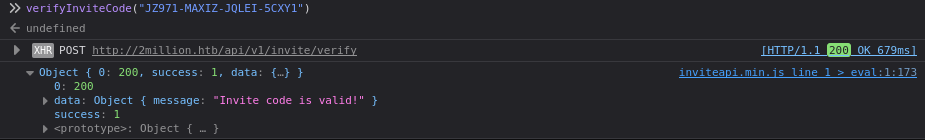

# Two-millions-Hack The Box - Ejemplo

TwoMillion es un lanzamiento especial de HackTheBox para celebrar los 2.000.000 de miembros. Se lanzó directamente a los retirados, así que no se otorgan puntos ni sangre, solo para correr. Presenta un sitio web que se asemeja a la plataforma original de HackTheBox, incluyendo el desafío del código de invitación original que debía resolverse para registrarse. Una vez registrado, enumeraré la API para encontrar un endpoint que me permita convertirme en administrador y luego encontraré una inyección de comandos en otro endpoint de administrador.


## Reconocimiento
Iniciamos un escaneo con Nmap 
```bash
nmap -p- -sS --min-rate 5000 --open -vvv 10.10.11.221 -oG allPorts         
```

### Explicacion de parametros
*   -p-  pedimos que escanee todos los puertos desde el 1 al 65535
*   -sS  para enviar peticiones sin que complete el la conexion(three-way handshake”) solo envia un syn ack y lo corta con un RST asì podemos evitar dejar tantos logs y pasar mas desapercibidos
*   --min-rate 5000 para decirle que envie un minimo de 5000 paquetes por segundo
*   --open para que nos valla mostrando puertos abiertos sobre la marcha
*   -vvv triple verbose para que nos valla mostrando en tiempo real todo el progreso del escaneo y no esperar a que termine
*   -oG allPorts para que nos exporte el escaneo en un formato de nmap asì no debemos hacerlo de nuevo

### Resultado

Descubrimos que los puertos 22 y 80 estàn expuestos
22/tcp open  ssh     syn-ack ttl 63
80/tcp open  http    syn-ack ttl 63

### Exploramos que version es del servicio expuesto
```bash
nmap -sCV -p22,80 10.10.11.221 -vvv -oN targeted         
```
*  -sCV es una fusion de -sC -sV para detectar servicios y versiones.
*  -oN para que guarde el resultado del escaneo en un formato normal como si apareciera en la terminal

vemos que las versiones son las siguientes:
OpenSSH 8.9p1 Ubuntu 3ubuntu0.1
nginx

Vemos que la ip redirige a 2million.htb
lo sumamos al /etc/hosts para tener visibilidad

### Fuerza bruta para descubrir subdominios

```bash
ffuf -u http://10.10.11.221 -H "Host: FUZZ.2million.htb" \                                                      37s  system root@kali
-w /usr/share/seclists/Discovery/DNS/subdomains-top1million-5000.txt \
-mc all -ac -t 50
```
No pudimos encontrar nada asì que vamos directo a la web

## Vemos una pagina web de Hack-The-Box


## Usamos feroxbuster para descubrir rutas ya que wfuzz y gobuster no funcionaban.


<pre 
  class="command-line" 
  data-prompt="kali@kali $" 
  data-output="4"
><code class="language-bash"># Bash script with shell
feroxbuster -u http://2million.htb
                                                                                    
 ___  ___  __   __     __      __         __   ___
|__  |__  |__) |__) | /  `    /  \ \_/ | |  \ |__
|    |___ |  \ |  \ | \__,    \__/ / \ | |__/ |___
by Ben "epi" Risher 🤓                 ver: 2.11.0
───────────────────────────┬──────────────────────
 🎯  Target Url            │ http://2million.htb
 🚀  Threads               │ 50
 📖  Wordlist              │ /usr/share/seclists/Discovery/Web-Content/raft-medium-directories.txt
 👌  Status Codes          │ All Status Codes!
 💥  Timeout (secs)        │ 7
 🦡  User-Agent            │ feroxbuster/2.11.0
 💉  Config File           │ /etc/feroxbuster/ferox-config.toml
 🔎  Extract Links         │ true
 🏁  HTTP methods          │ [GET]
 🔃  Recursion Depth       │ 4
───────────────────────────┴──────────────────────
 🏁  Press [ENTER] to use the Scan Management Menu™
──────────────────────────────────────────────────
301      GET        7l       11w      162c Auto-filtering found 404-like response and created new filter; toggle off with --dont-filter
302      GET        0l        0w        0c http://2million.htb/logout => http://2million.htb/
401      GET        0l        0w        0c http://2million.htb/api
200      GET       27l      201w    15384c http://2million.htb/images/favicon.png
405      GET        0l        0w        0c http://2million.htb/api/v1/user/register
200      GET        1l        8w      637c http://2million.htb/js/inviteapi.min.js
405      GET        0l        0w        0c http://2million.htb/api/v1/user/login
200      GET       80l      232w     3704c http://2million.htb/login
200      GET       96l      285w     3859c http://2million.htb/invite
302      GET        0l        0w        0c http://2million.htb/home => http://2million.htb/
200      GET      245l      317w    28522c http://2million.htb/images/logofull-tr-web.png
200      GET      260l      328w    29158c http://2million.htb/images/logo-transparent.png
200      GET       46l      152w     1674c http://2million.htb/404
200      GET        5l     1881w   145660c http://2million.htb/js/htb-frontend.min.js
200      GET       13l     2209w   199494c http://2million.htb/css/htb-frontpage.css
200      GET       13l     2458w   224695c http://2million.htb/css/htb-frontend.css
200      GET       94l      293w     4527c http://2million.htb/register
200      GET        8l     3162w   254388c http://2million.htb/js/htb-frontpage.min.js
200      GET     1242l     3326w    64952c http://2million.htb/
405      GET        0l        0w        0c http://2million.htb/api/v1/invite/verify </code>

</pre> 


Hay cosas que nos interesan pero destaca /js/inviteapi.min.js.
Por Ejemplo encontramos:
## Un Login


## Un register


## Un invite
Nos deja poner un codigo de invitaciòn que mas adelante conseguiremos


## Encontramos al final en la pagina invite un inviteapi.min.js
```js
  <script src="/js/htb-frontend.min.js"></script>
    <script defer src="/js/inviteapi.min.js"></script>
    <script defer>
```
## Aparece esto en el recurso de api
```js
eval(function(p,a,c,k,e,d){e=function(c){return c.toString(36)};if(!''.replace(/^/,String)){while(c--){d[c.toString(a)]=k[c]||c.toString(a)}k=[function(e){return d[e]}];e=function(){return'\\w+'};c=1};while(c--){if(k[c]){p=p.replace(new RegExp('\\b'+e(c)+'\\b','g'),k[c])}}return p}('1 i(4){h 8={"4":4};$.9({a:"7",5:"6",g:8,b:\'/d/e/n\',c:1(0){3.2(0)},f:1(0){3.2(0)}})}1 j(){$.9({a:"7",5:"6",b:\'/d/e/k/l/m\',c:1(0){3.2(0)},f:1(0){3.2(0)}})}',24,24,'response|function|log|console|code|dataType|json|POST|formData|ajax|type|url|success|api/v1|invite|error|data|var|verifyInviteCode|makeInviteCode|how|to|generate|verify'.split('|'),0,{}))
```
Con algo muy particular y es que nos dice el nombre de la variable que envia un POST al endpoint /api/v1/invite/verifyInviteCode

```bash
makeInviteCode
```

Lo ejecutamos desde la consola


## Decodificamos ROT13
Vemos que dice ROT13 lo cual es una pista que su codificacion es ROT13
ROT13 es un metodo de codificacion que rota 13 posiciones la posicion real de la letra
Ejemplo la A es la N
Puedes hacerlo con chat-Gpt o desde la terminal de linux con el siguiente comando:

```bash
echo "Va beqre gb trarengr gur vaivgr pbqr, znxr n CBFG erdhrfg gb /ncv/i1/vaivgr/trarengr" | tr 'A-Za-z' 'N-ZA-Mn-za-m'
```
Vemos que la ruta que genera los codigos de invitados es
/api/v1/invite/generate
por lo que con curl vamos a enviar una peticion por POST y generarlo

<pre 
  class="command-line" 
  data-prompt="kali@kali $" 
  data-output="4"
><code class="language-bash"># Bash script with shell
curl -X POST http://2million.htb/api/v1/invite/generate
{"0":200,"success":1,"data":{"code":"SDZVUEktNFNWNFktOVdPWlMtS1BXMFU=","format":"encoded"}}# </code>
</pre> 
Ese codigo es el que nos genera


Podemos verlo de mejor manera asi:


<pre 
  class="command-line" 
  data-prompt="kali@kali $" 
  data-output="4"
><code class="language-bash"># Bash script with shell
curl -X POST http://2million.htb/api/v1/invite/generate -s | jq
{
  "0": 200,
  "success": 1,
  "data": {
    "code": "Slo5NzEtTUFYSVotSlFMRUktNUNYWTE=",
    "format": "encoded"
  }
} </code>
</pre> 

Vemos que nos dice encode y por su forma de letras y numeros mas el = al final nos dice que es una codificacion en base 64
Asi que ahora decodificamos

<pre 
  class="command-line" 
  data-prompt="kali@kali $" 
  data-output="4"
><code class="language-bash"># Bash script with shell
echo "Slo5NzEtTUFYSVotSlFMRUktNUNYWTE=" | base64 -d
JZ971-MAXIZ-JQLEI-5CXY1# </code>
</pre> 
      
Vamos de nuevo a la consola de la seccion invite y probamos para ver si es correcto el codigo


Nos dice 1 lo que es codigo de estado exitoso.
Asi que ahora lo ponemos en el campo y nos redirige directamente al register con el codigo puesto


Nos registramos,iniciamos sesion y ya estamos dentro.


Dice que el sitio está realizando migraciones de bases de datos, y algunas características no están disponibles. En realidad, eso significa la mayoría. El tablero, las reglas y los enlaces de Cambiar sesión bajo el trabajo de "Main", y tienen buenas páginas de devolución al HTB original.

Bajo la página "Labs", el único enlace que realmente funciona es la página "Access", que conduce a /home/access:


Haciendo clic en "Connection Pack". y "Regengerate", ambos devuelven un .ovpnArchivo. Es una configuración válida de conexión OpenVPN, y puedo tratar de conectarme con ella, pero no funciona.

## API
Envía una solicitud de GET a /api/v1/user/vpn/generate, y Regenerate envía un GET a /api/v1/user/vpn/regenerate.

Enviaré estas solicitudes a Burp Repeater y jugar con la API. /apidevuelve una descripción:


# Enumerar la API de administración

No soy administrador,logico.


Si trato de POST a /api/v1/admin/vpn/generate, devuelve 401 Unauthorized:


Sin embargo, una petición de PUT a /api/v1/admin/settings/updateno devuelve 401, pero 200, con un error diferente en el cuerpo:

